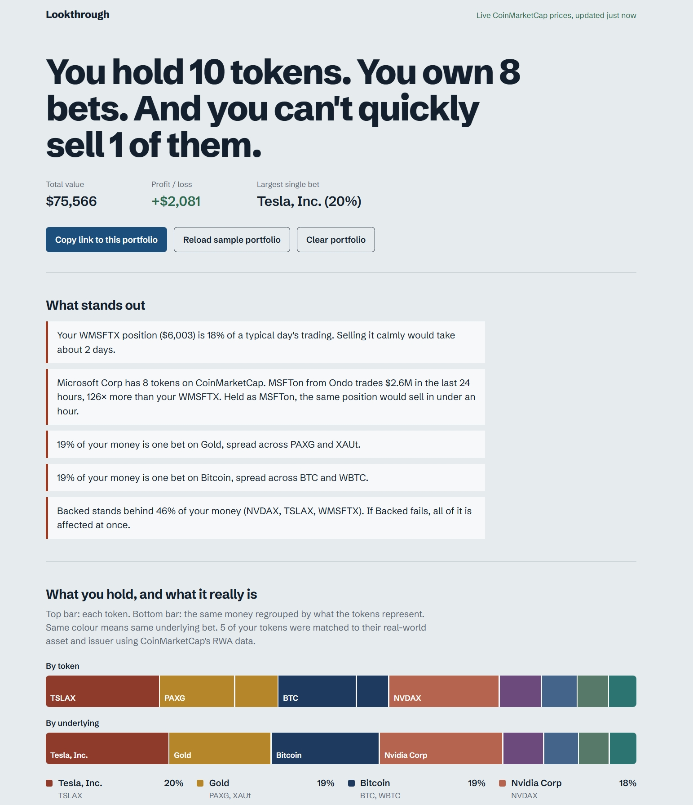
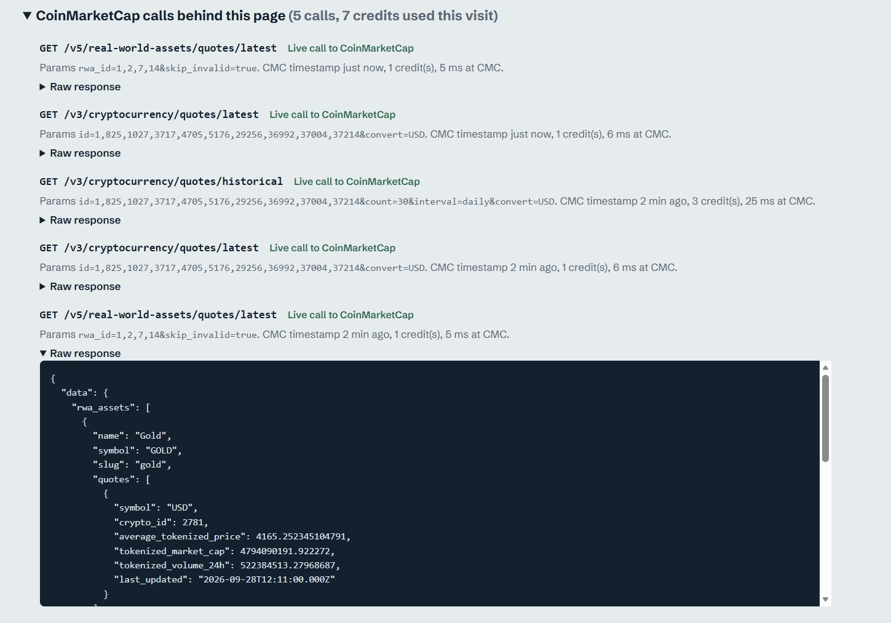
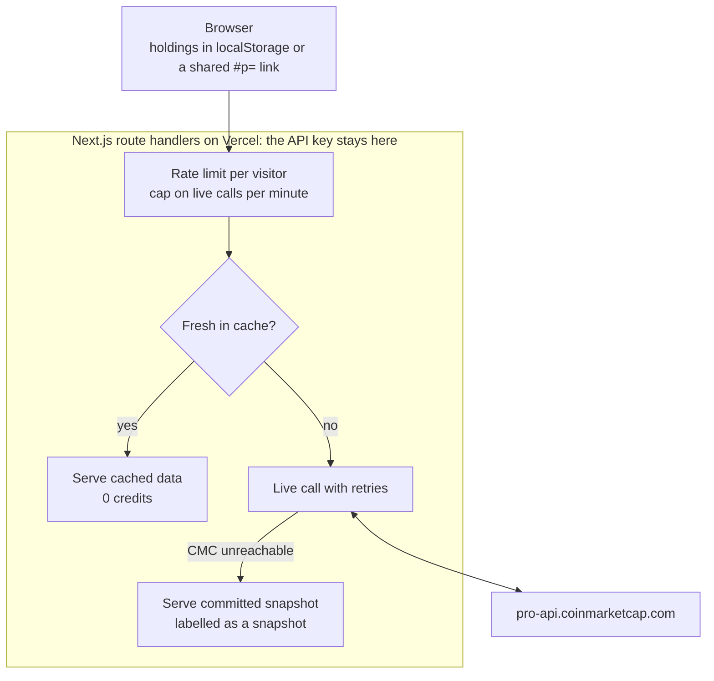
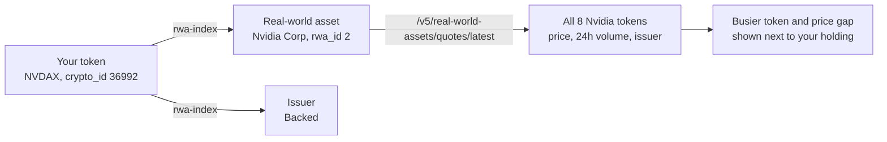

# Lookthrough

[](https://github.com/oscarosk/lookthrough/actions/workflows/ci.yml)

**"You hold 10 tokens. You own 8 bets. And you can't quickly sell 1 of them."**

Lookthrough is a portfolio tracker for people who hold crypto and tokenised real-world assets side by side: Bitcoin next to tokenised gold, tokenised stocks and treasury tokens. A wallet shows a list of tokens. Lookthrough answers three questions about them, using live CoinMarketCap data including its real-world asset (RWA) endpoints:

1. **What do my tokens really own?** Tokens are regrouped by the asset behind them. PAXG and XAUt are both gold. BTC and WBTC are both Bitcoin. NVDAX is Nvidia.
2. **Who am I trusting?** Tokenised assets depend on an issuer. Lookthrough shows when one issuer stands behind a large share of your money.
3. **Could I actually sell it?** Every position is compared with the token's trading volume on a typical day. When a busier token exists for the same asset, Lookthrough says how fast the same position would sell in that token instead.

> **Track:** Real World Assets · **Built for:** Build with CMC: API Hackathon · #BuildwithCMC

| | |
|---|---|
| **Live app** | https://lookthrough-tau.vercel.app |
| **Open the example portfolio** | [lookthrough-tau.vercel.app/#p=…](https://lookthrough-tau.vercel.app/#p=1:0.12:64640.4,3717:0.05:76189,1027:1.8:2973.26,825:4000:0.999535,4705:2:3497.85,5176:1.5:3744.74,36992:60:213.477,37004:40:436.106,29256:3000:1.11367,37214:11.62:547.561) |
| **Demo video** | TODO_VIDEO_LINK |
| **DoraHacks BUIDL** | TODO_BUIDL_LINK |



## Try it in 30 seconds

1. Open the [example portfolio](https://lookthrough-tau.vercel.app/#p=1:0.12:64640.4,3717:0.05:76189,1027:1.8:2973.26,825:4000:0.999535,4705:2:3497.85,5176:1.5:3744.74,36992:60:213.477,37004:40:436.106,29256:3000:1.11367,37214:11.62:547.561), or open the [live app](https://lookthrough-tau.vercel.app) and click **Try it with a sample portfolio**.
2. Read the verdict at the top, then **What stands out**.
3. Compare the two bars: **By token** against **By underlying**. Same colour means the same bet.
4. In **Could you sell it?**, find the Wrapped Microsoft token (WMSFTX): about 18% of a typical day's trading, roughly two days to sell. Microsoft has 8 tokens on CoinMarketCap, and Ondo's MSFTon trades over 100× more.
5. Open **CoinMarketCap calls behind this page** at the bottom: every call, its parameters, credits used, and the raw JSON response.
6. Try your own holdings: paste lines like `BTC 0.5` or `PAXG 2 @ 3900` into **Add your holdings**, then use **Copy link to this portfolio** to share the result.

## What we found: the census

`npm run census` reads every real-world asset on CoinMarketCap and the 24-hour volume of every token behind them. Measured on 28 September 2026:

- CoinMarketCap tracks **7,942** real-world assets. Only **793** have at least one token.
- Those assets have **1,310** tokens, excluding derivatives.
- **Only 27.4%** of those tokens trade enough to sell a $5,000 position within a day (at least $50,000 of daily volume, selling at 10% of it).
- **60.2%** (789 tokens) show no price or no trading volume at all.
- **116** assets have two or more traded tokens. In **106** of them, the busiest token trades at least 10× more than the quietest. **Which token you buy matters as much as which asset.**

Full method and a per-issuer table: [docs/CENSUS.md](docs/CENSUS.md). This is why Lookthrough checks each position you hold, rather than assuming a token is as liquid as the asset it represents.

## CoinMarketCap endpoints used

| Endpoint | Used for | Cached |
|---|---|---|
| `GET /v3/cryptocurrency/quotes/latest` | Price, 24h volume (with its CEX/DEX split) and 24h change for every holding, one call per portfolio | 2 minutes |
| `GET /v3/cryptocurrency/quotes/historical` | 30 daily volumes per holding; the exit check uses the median day | 6 hours |
| `GET /v1/cryptocurrency/map` | Tickers to CoinMarketCap IDs, choosing between tokens that share a ticker | 24 hours |
| `GET /v5/real-world-assets/quotes/latest` | For each tokenised holding: its real-world asset, and every other token CMC tracks for that asset, with price, volume and issuer | 5 minutes |
| `GET /v5/real-world-assets/issuers/list` | All RWA issuers, to build the token → asset → issuer index | build step |
| `GET /v5/real-world-assets/issuers` | Every token each issuer has created, with its `crypto_id` and `rwa_id` | build step |
| `GET /v5/real-world-assets/assets/list` | Every tracked real-world asset, for the census | build step |
| `GET /v1/key/info` | Health check of plan and credits (0 credits), at `/api/key-info` | 30 seconds |

A full visit with the sample portfolio uses about 5 to 10 credits. Building the index uses about 30 credits and the census about 50.

## Evidence of a real API call



Every call the app makes is listed in its **CoinMarketCap calls behind this page** panel, with endpoint, parameters, credits and the raw response. The same data from the command line:

```bash
curl -H "X-CMC_PRO_API_KEY: $CMC_API_KEY" \
  "https://pro-api.coinmarketcap.com/v5/real-world-assets/quotes/latest?rwa_id=2"
```

Trimmed response, 28 September 2026 (all 8 tokens CoinMarketCap tracks for Nvidia; 5 shown):

```json
{
  "data": {
    "rwa_assets": [{
      "name": "Nvidia Corp", "symbol": "NVDA", "rwa_id": 2, "asset_type": "stock",
      "average_tokenized_price": 223.2187, "tokenized_volume_24h": 61745468.42,
      "tokens": [
        { "symbol": "NVDAX",  "name": "NVIDIA tokenized stock (xStock)",    "crypto_id": 36992, "issuer_name": "Backed Assets",    "price": 223.5267, "volume_24h": 8279750.56 },
        { "symbol": "NVDA",   "name": "NVIDIA Tokenized Stock (Robinhood)", "crypto_id": 40685, "issuer_name": "Robinhood",        "price": 223.1222, "volume_24h": 34920340.74 },
        { "symbol": "NVDAB",  "name": "NVIDIA Tokenized bStocks",           "crypto_id": 40215, "issuer_name": "bStocks",          "price": 223.2233, "volume_24h": 15012215.07 },
        { "symbol": "NVDA.D", "name": "NVIDIA tokenized stock (Dinari)",    "crypto_id": 28616, "issuer_name": "Dinari Assets",    "price": null,     "volume_24h": null },
        { "symbol": "NVDA",   "name": "NVIDIA (Derivatives)",               "crypto_id": 38153, "issuer_name": "NA (Derivatives)", "price": 223.4363, "volume_24h": 342989.97 }
      ]
    }]
  },
  "status": { "timestamp": "2026-09-28T08:22:39.158Z", "error_code": "0", "error_message": "", "credit_count": 1 }
}
```

One call returns every token for an asset. That is what lets Lookthrough tell an NVDAX holder that Robinhood's token for the same stock trades about 4× more.

Code that makes the calls: [`lib/cmc-core.ts`](lib/cmc-core.ts) (HTTP, retries), [`lib/cmc.ts`](lib/cmc.ts) (cache, credit guard, snapshot fallback), and the routes in [`app/api/`](app/api/).

## How it works



**Token → asset → issuer.** The RWA issuer endpoints list every token each issuer has created, with its ordinary CoinMarketCap `crypto_id` and the `rwa_id` of the asset it represents. `npm run rwa-index` saves that link table ([`data/rwa-index.json`](data/rwa-index.json), 1,444 linked tokens), so looking up a holding costs no credits. The app then calls `/v5/real-world-assets/quotes/latest` live for the assets you hold. Crypto wrappers and stablecoins that are not RWAs (WBTC, stETH, USDT…) come from a short curated table in [`lib/underlying.ts`](lib/underlying.ts). Anything unknown counts as its own bet.



**Which volume drives what.** One day's volume is noisy, so the verdict does not rely on it:

| Part of the app | Volume used |
|---|---|
| Verdict, "Selling it" grade, days to sell | Median of the last 30 daily volumes (needs at least 7 days of history, otherwise the last 24h, labelled as such) |
| "Daily volume" column | The median, with today's 24h volume underneath |
| "Trading far below normal" warning | Today's 24h volume against the median |
| Busier-token suggestion | The other token's last 24h volume, from the RWA endpoint |
| Census | 24h volume across all tokens, dated |

**Selling pace.** Days to sell = position value ÷ (10% of a typical day's volume). Selling more than about 10% of daily volume usually moves the price; this is a rule of thumb, stated in the app.

**Wrapper comparison** ([`lib/rwa.ts`](lib/rwa.ts)). Each tokenised holding is compared with the other tokens for the same asset on volume and price. Derivative "tokens" are left out because they are not claims on the asset.

## Reliability during judging

- **Runs on the free plan.** According to CoinMarketCap's plan comparison, everything Lookthrough calls at runtime is included in the free Basic plan (latest quotes, a year of daily historical quotes, and the RWA quotes endpoint), so the live demo keeps working after the hackathon's Startup access ends.
- **Credits are protected.** Each visitor can make 40 requests a minute, and the server makes at most 60 live CoinMarketCap calls a minute, serving cached data beyond that ([`lib/ratelimit.ts`](lib/ratelimit.ts)).
- **Snapshot fallback.** `npm run snapshot` saves real responses for the sample portfolio into `data/snapshots.json`. If CoinMarketCap cannot be reached, the app serves them and says so in the header. Nothing is presented as live when it is not.

## Privacy

Holdings are stored only in your browser. A shared link carries the portfolio after the `#`, which browsers do not send to any server. There is no account, no database and no tracking.

## What the API made possible, and where it got in the way

**Made possible.** One RWA quotes call returns every token for an asset, with issuer, price and volume, which is the whole basis of the wrapper comparison. The issuer endpoints expose the `crypto_id` ↔ `rwa_id` link that turns a list of tokens into a look-through. The v3 quotes add a CEX/DEX split of volume, and historical quotes let the exit check use a typical day instead of today. A whole portfolio refresh costs about one credit.

**Got in the way.** Each item below happened while building Lookthrough and can be reproduced:

1. **`error_code` type differs between endpoints and from the docs.** The RWA reference documents `error_code` as an integer. `/v5/real-world-assets/*` and `/v3/cryptocurrency/quotes/latest` return the string `"0"` with `error_message: ""`, while `/v1/cryptocurrency/map` and `/v1/key/info` return the integer `0` with `error_message: null`. Our first RWA integration treated every successful v5 call as an error. Suggestion: one type everywhere, matching the docs.
2. **No direct way from a token to its real-world asset.** Given a `crypto_id` (for example 36992, NVDAX), there is no parameter or field that returns its `rwa_id`. We crawled every issuer's token list, about 30 calls and 30 credits, to build that index. Suggestion: accept `crypto_id` on `/v5/real-world-assets/quotes/latest`, or add `rwa_id` to `/v3/cryptocurrency/quotes/latest` and `/v2/cryptocurrency/info`.
3. **Many issuer tokens are not linked to an asset.** The issuers list reports 2,400 tokens across its issuers; in our crawl, 1,444 came back with an `rwa_id`. The rest have `rwa_id: null`, so they cannot be looked through.
4. **No reference price for the underlying.** The track brief suggests comparing a tokenised asset against its underlying, but RWA quotes give `average_tokenized_price` (the average of the tokens) and `tradfi_markets` (venue and ticker, no price). We could compare tokens with each other, not with the real Nvidia share. Suggestion: a reference price and its timestamp on RWA quotes.
5. **"No price" and "no trading" look the same.** 60.2% of tokens return `price: null` or `volume_24h: null`. It is unclear whether a token has no market or CoinMarketCap has no data for it. A status field would help.
6. **Per-venue liquidity is out of reach for most builders.** `/v5/real-world-assets/market-pairs/list` and cryptocurrency market pairs are on Growth and above, not on the Startup plan given to hackathon participants, so liquidity can only be judged from aggregate volume.
7. **Ticker collisions.** "NVDA" is both Robinhood's Nvidia token (crypto_id 40685) and a derivative (38153). `/v1/cryptocurrency/map?symbol=` returns several matches with no issuer or type, so a user typing a ticker needs a second step to pick the right one.
8. **Derivatives share the token list with redeemable tokens.** They appear under an issuer named `"NA (Derivatives)"`, with `market_cap: 0`. A token-type field would be cleaner than matching an issuer name.
9. **Empty issuers.** `/v5/real-world-assets/issuers/list` includes issuers with `num_tokens: 0` (Bitget Assets, Coinbase, Swarm Assets).
10. **Hackathon access.** Our Startup upgrade arrived after a support ticket, a few days before the deadline. The plan comparison page answered our access questions faster than the Q&A.

## Limitations

- Sample amounts and buy prices are illustrative.
- The census and snapshot are point-in-time measurements, dated in the app. Reported volume can include low-quality venues.
- Not financial advice.

## Run it locally

Requires Node.js 20 or newer.

```bash
git clone https://github.com/oscarosk/lookthrough.git
cd lookthrough
npm install
cp .env.example .env.local   # then put your CMC API key in .env.local
npm run dev                  # http://localhost:3000
```

Other scripts:

```bash
npm test          # 21 unit tests: look-through, exit check, RWA parsing, share links, pasting
npm run lint
npm run data      # rebuild the RWA index, run the census, save snapshots (about 80 credits)
```

The API key is read only on the server, from `CMC_API_KEY`. It is never sent to the browser or committed.

## Project structure

```
app/api/        Route handlers: quotes, history, rwa, resolve, symbol, key-info
components/     Dashboard, look-through bars, holdings table, issuers, census, API log
lib/            CMC client, cache and fallback, parsing, exit check, exposure, RWA helpers, share links
scripts/        rwa-index, census, snapshot
data/           Generated: RWA index, census results, snapshots
docs/CENSUS.md  Census method and per-issuer results
tests/          Vitest unit tests
```

## License

MIT, see [LICENSE](LICENSE).
